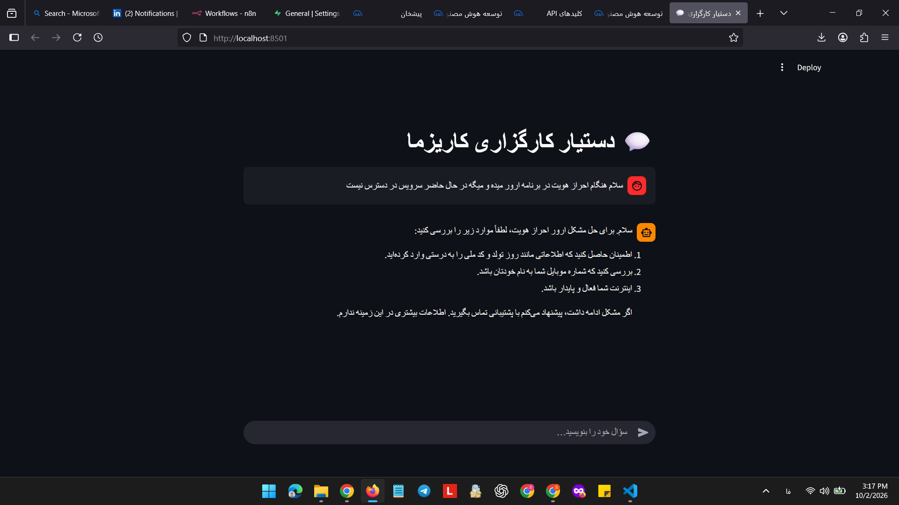

# دستیار کارگزاری کاریزما

چت‌بات پرسش و پاسخ فارسی برای کارگزاری کاریزما که با روش **RAG (Retrieval-Augmented Generation)** فقط بر اساس اسناد مرجع پاسخ می‌دهد.



## نحوه‌ی کار

1. **آماده‌سازی پایگاه داده (`ingest.py`):** فایل‌های مارک‌داون داخل `data/knowledge` بر اساس هدینگ‌ها به تکه‌های حداکثر ۹۰۰ کاراکتری تقسیم می‌شوند، برای هر تکه embedding ساخته می‌شود و در جدول `chunks` در Supabase ذخیره می‌گردد.
2. **جست‌وجو (`rag.py`):** سؤال کاربر به embedding تبدیل می‌شود و با تابع `match_chunks` در Supabase، شبیه‌ترین تکه‌ها (پیش‌فرض ۵ مورد، با حداقل شباهت ۰٫۲۵) پیدا می‌شوند.
3. **پاسخ‌دهی:** متن‌های پیدا‌شده همراه سؤال و ۶ پیام آخر گفتگو به مدل زبانی داده می‌شود. مدل موظف است فقط از همین متن‌ها پاسخ دهد؛ اگر پاسخ در منابع نبود، کاربر را به پشتیبانی ارجاع می‌دهد.
4. **رابط کاربری (`app.py`):** صفحه‌ی چت راست‌به‌چپ با Streamlit، همراه با نمایش منابع هر پاسخ.

## ویژگی‌ها

- پاسخ فقط بر پایه‌ی اسناد داخلی (بدون ساختن اطلاعات از خود مدل)
- نمایش منابع (عنوان بخش و نام فایل) برای هر پاسخ
- حفظ تاریخچه‌ی گفتگو و فهم پیام‌های کوتاه دنباله‌دار
- محدودیت‌های ایمنی: درخواست نکردن رمز عبور و کد یکبارمصرف، و ندادن مشاوره‌ی سرمایه‌گذاری یا پیشنهاد خرید/فروش سهام

## ساختار پروژه

```
app.py             رابط چت (Streamlit)
rag.py             هسته‌ی RAG: embedding، جست‌وجو و تولید پاسخ
ingest.py          تقسیم اسناد و ذخیره‌ی آنها در پایگاه داده
schema.sql         کد SQL ساخت پایگاه داده در Supabase
requirements.txt   وابستگی‌ها
01-05.md    فایل‌های مرجع 
image.png          تصویر نمونه از برنامه
```

## پیش‌نیازها

- Python 3.10 یا بالاتر
- یک پروژه در [Supabase](https://supabase.com)
- یک کلید API سازگار با OpenAI (برای embedding و چت)

## نصب و اجرا

۱. نصب وابستگی‌ها:

```bash
pip install -r requirements.txt
```

۲. ساخت پایگاه داده: محتوای فایل `schema.sql` را در بخش **SQL Editor** پروژه‌ی Supabase اجرا کنید. این کار افزونه‌ی `pgvector`، جدول `chunks` و تابع `match_chunks` را می‌سازد.

۳. ساخت فایل `.env` کنار `app.py`:

```
SUPABASE_URL=...
SUPABASE_KEY=...
LLM_API_KEY=...

# اختیاری (مقادیر پیش‌فرض)
LLM_BASE_URL=
LLM_MODEL=gpt-4o-mini
EMBED_MODEL=text-embedding-3-small
```

۴. بارگذاری اسناد در پایگاه داده (بار اول و هر بار که اسناد تغییر کنند):

```bash
python ingest.py
```

۵. اجرای برنامه:

```bash
streamlit run app.py
```

سپس آدرس `http://localhost:8501` را در مرورگر باز کنید.

## نکته‌ی امنیتی

فایل `.env` شامل کلیدهای محرمانه است و نباید در مخزن قرار گیرد (در `.gitignore` قرار دارد).
